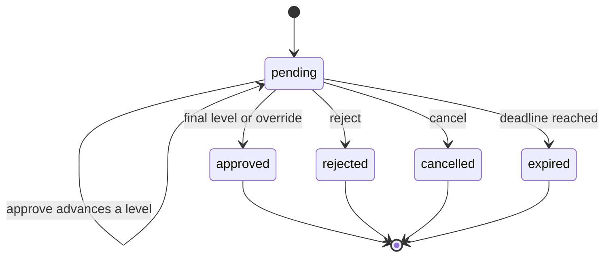
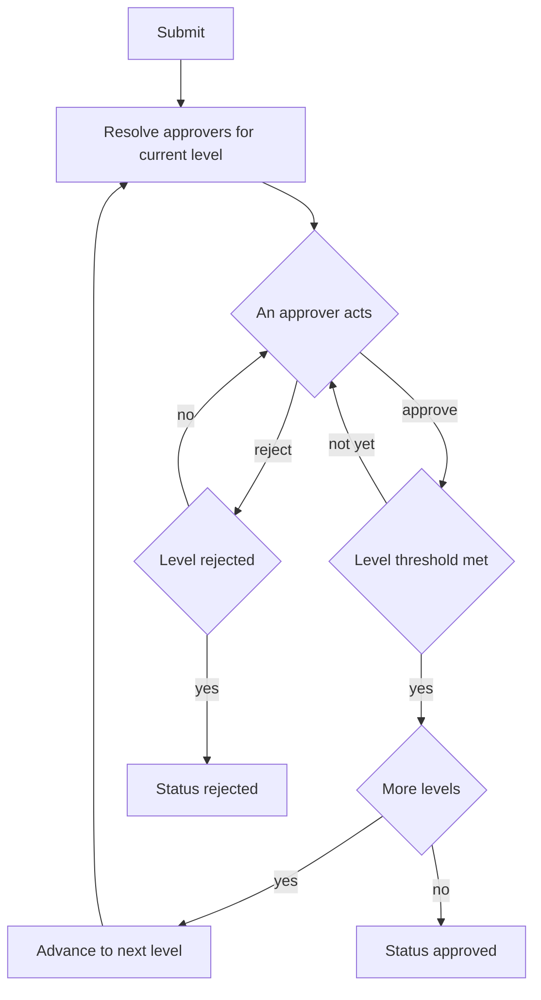
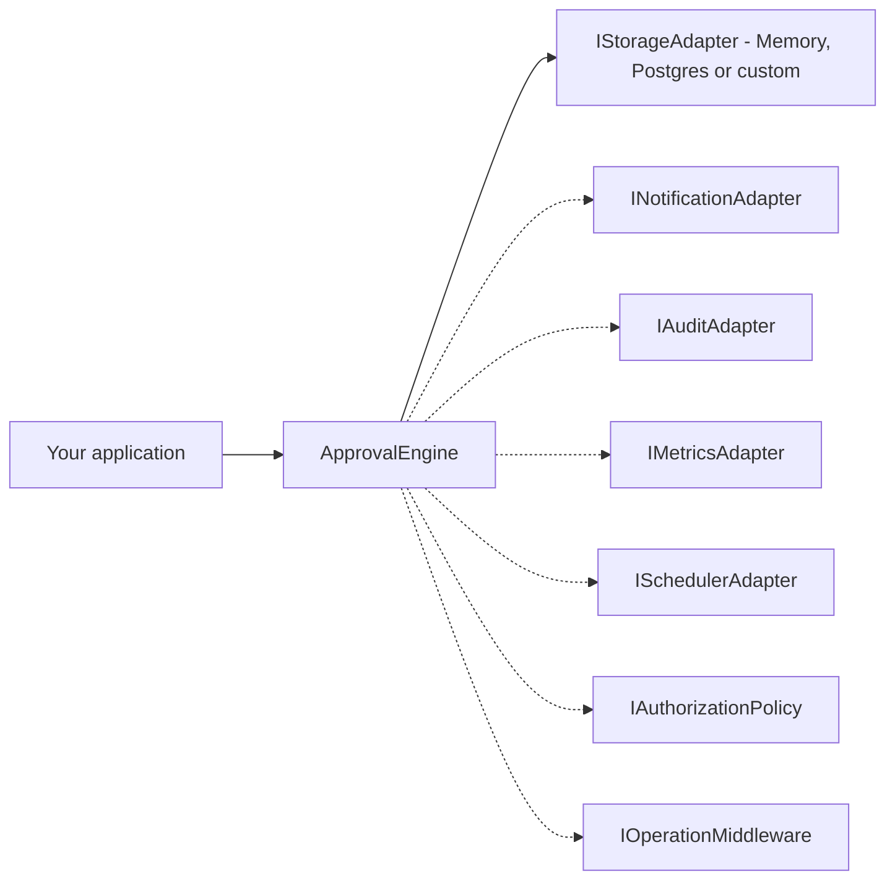

<div align="center">

# hierarchical-approval

**TypeScript-first multi-level approval workflows for enterprise systems.**
Multi-tenant · audit-ready · fully pluggable · zero runtime dependencies you don't opt into.

[](https://www.npmjs.com/package/hierarchical-approval)
[](https://www.npmjs.com/package/hierarchical-approval)
[](https://github.com/matthews-wong/hierarchical-approval/actions/workflows/ci.yml)
[](https://www.typescriptlang.org/)
[](https://bundlephobia.com/package/hierarchical-approval)
[](./LICENSE)
[](./tests)

[**Documentation**](https://hierarchical-approval.matthewswong.com) ·
[**npm**](https://www.npmjs.com/package/hierarchical-approval) ·
[**Changelog**](./IMPROVEMENTS.md) ·
[**Examples**](./examples)

</div>

```sh
npm install hierarchical-approval
# peer dep for Postgres only
npm install pg @types/pg
```

> 📖 Full docs & live guides: **[hierarchical-approval.matthewswong.com](https://hierarchical-approval.matthewswong.com)**

<details>
<summary><strong>Table of contents</strong></summary>

- [Why another approval library?](#why-another-approval-library)
- [How it works](#how-it-works) — the 30-second mental model + diagrams
- [Quick start](#quick-start)
- [Core concepts](#core-concepts)
- [Installation and setup](#installation-and-setup)
- [`new ApprovalEngine(options)`](#new-approvalengineoptions)
- [Approver types](#approver-types)
- [Lifecycle operations](#lifecycle-operations)
- [Queries](#queries)
- [Template management](#template-management)
- [Utility methods](#utility-methods)
- [Events](#events)
- [Enterprise adapters](#enterprise-adapters)
- [Custom storage adapter](#custom-storage-adapter)
- [Testing](#testing)
- [Error handling](#error-handling)
- [Multi-tenancy](#multi-tenancy)
- [Template reference](#template-reference)
- [FAQ](#faq)
- [License](#license)

</details>

---

## Why another approval library?

Approval workflows are deceptively simple until they aren't. Most teams start with `if (amount > 1000) notifyManager()` and end up with hundreds of lines of procedural logic entangled with their database, email service, and audit code — and rewrite it whenever a new requirement arrives.

`hierarchical-approval` gives that logic a permanent, tested home:

| Pain point | What this library does |
|---|---|
| Hardcoded approval chains | Named **templates** — define once, reuse across any document type |
| Race conditions on concurrent approvals | **Optimistic locking** with a version field + configurable retry policy |
| Duplicate submissions (network retry, double-click) | Built-in **idempotency** keyed by tenant + document + template |
| No compliance trail | Immutable **audit log** with old/new state diff on every mutation |
| `new Date()` in production code makes tests unreliable | Injectable **Clock** interface — freeze time without monkey-patching |
| "Escalate to skip-level manager after 48 h" | Built-in **escalation scheduler** with delegation + time-limited proxying |
| SLA as an afterthought | **SLA tracking** baked in; `approval:sla_breached` event fires automatically |
| Test suites hit a real database | **`ApprovalTestKit`** + **`ManualClock`** — deterministic, zero I/O |
| Kafka/Datadog/BullMQ integration needed | Six **pluggable adapter interfaces** for notifications, metrics, audit, scheduling, auth, and middleware |

### Compared to existing libraries

**`approval-flow`** — Single-level only; no multi-tenancy; no audit trail; last published 2020.  
**`workflow-engine`** — Generic state machine; you implement every guard, every condition, every audit entry yourself.  
**`node-approval`** — No TypeScript; no idempotency; no optimistic locking.  
**Hand-rolled** — You *will* hit the concurrent-approval race condition eventually. This library has 195 tests covering it.

---

## How it works

**The 30-second mental model:** you define a reusable **template** (the approval blueprint), then **submit** documents against it. Each submission becomes an **instance** that walks through the template's **levels** one at a time. At each level the configured **approvers** act, and the level's **mode** decides when that level is satisfied. When the last level passes, the instance is `approved`.

| Term | What it is |
|---|---|
| **Template** | A named, reusable blueprint — ordered levels, approvers, modes, conditions, escalation, SLA. Define once, reuse for every document of that type. |
| **Instance** | One running approval: a specific document moving through a template. Holds the live state, the audit log, and a snapshot of the template at submit time. |
| **Level** | A single step in the chain (e.g. "Manager", then "Finance"). Levels run **sequentially**. |
| **Approver** | Who may act on a level — a fixed `user`, a `role`, or someone resolved dynamically at runtime. |
| **Mode** | How a level passes: `any`, `all`, `majority`, `quorum` (N-of-M), or `weighted`. |

### The status lifecycle



> `submit()` creates the instance in `pending`; `resubmit()` on a rejected instance spawns a new linked instance starting again at level 1.

### How an approval flows

A level is satisfied according to its mode (`any`, `all`, `majority`, `quorum`, or `weighted`):



### Architecture — a small core with pluggable ports

The engine never talks to your database, queue, or notification service directly — it talks to **interfaces you implement** (or use the built-ins). Only storage is required; everything else is opt-in.

Solid arrow = required (storage). Dotted arrows = optional ports you can plug in:



---

## Quick start

```ts
import { ApprovalEngine } from 'hierarchical-approval';
import { MemoryAdapter } from 'hierarchical-approval/adapters/memory';

const engine = new ApprovalEngine({
  adapter: new MemoryAdapter(),
  tenantId: 'acme',
});

// 1. Define a reusable template
await engine.defineTemplate({
  name: 'purchase-order',
  documentType: 'purchase_order',
  levels: [
    {
      level: 1,
      name: 'Manager',
      approvers: [{ type: 'user', userId: 'mgr-1' }],
      mode: 'any',
    },
    {
      level: 2,
      name: 'Finance',
      approvers: [{ type: 'role', role: 'finance-team' }],
      mode: 'any',
    },
  ],
  // Finance level only activates above $10 k
  conditions: [
    {
      when: { field: 'amount', operator: '>', value: 10000 },
      addLevels: [
        {
          level: 2,
          name: 'Finance',
          approvers: [{ type: 'user', userId: 'fin-1' }],
          mode: 'any',
        },
      ],
    },
  ],
  slaDeadlineDays: 2,
  allowOverride: true,
});

// 2. Submit a document
const instance = await engine.submit({
  templateName: 'purchase-order',
  documentId: 'po-0042',
  documentType: 'purchase_order',
  submittedBy: 'alice',
  data: { amount: 15000, vendor: 'Acme Corp' },
});
// instance.levels has two levels because amount > 10000

// 3. Manager approves
await engine.approve(instance.id, { approverId: 'mgr-1', comment: 'Looks good' });

// 4. Finance approves — instance is now 'approved'
await engine.approve(instance.id, { approverId: 'fin-1' });

await engine.shutdown();
```

---

## Core concepts

### Templates

A **template** is the reusable definition of an approval chain. It specifies who must approve (by user ID, role, or custom resolver), in what order, under what conditions, and what SLA applies.

Templates are **snapshotted** at submit time. You can update a template (via `updateTemplate()`) without affecting any in-flight instances — each instance carries a `templateSnapshot` with the escalation and SLA config that was in effect when it was submitted. Each template also carries a `version` counter and `previousVersionId` for lineage tracking.

### Instances

An **instance** is a single document moving through a template. Key fields:

| Field | Type | Description |
|---|---|---|
| `id` | `string` | Unique instance ID |
| `status` | `'pending' \| 'approved' \| 'rejected' \| 'cancelled' \| 'expired'` | Current status |
| `currentLevel` | `number` | Active level number |
| `version` | `number` | Optimistic lock version |
| `levels` | `ApprovalLevelInstance[]` | Per-level state (approverIds, approvedBy, rejectedBy) |
| `auditLog` | `AuditEntry[]` | Full immutable history |
| `idempotencyKey` | `string` | Dedup key — same submit returns the same instance |
| `slaDeadlineAt` | `Date?` | When the SLA expires |
| `slaBreachedAt` | `Date?` | When the SLA was breached (set automatically) |
| `expiresAt` | `Date?` | Hard deadline — instance auto-expires after this |
| `deadlineAction` | `'cancel' \| 'reject'` | What to do when `expiresAt` passes |
| `parentInstanceId` | `string?` | Set on resubmitted instances |
| `templateSnapshot` | `object` | Frozen copy of escalation/SLA config at submit time |

### Approval modes

Each level's `mode` field controls how many approvers are required:

| Mode | Required | Extra config |
|---|---|---|
| `'any'` | One approver is enough | — |
| `'all'` | Every listed approver must act | — |
| `'majority'` | More than half must approve | — |
| `'quorum'` | A fixed **N-of-M** threshold approves | `minApprovals` |
| `'weighted'` | Cumulative approver **weight** meets a threshold | `threshold`, optional `weights` |

A level is **rejected** as soon as the outcome becomes mathematically impossible — e.g. a `quorum` of 2-of-3 is rejected after the second rejection (only one approver remains), and a `weighted` level is rejected once the weight still achievable falls below `threshold`.

```ts
// Quorum: any 2 of these 3 directors must approve
{
  level: 1,
  name: 'Board',
  mode: 'quorum',
  minApprovals: 2,
  approvers: [
    { type: 'user', userId: 'd1' },
    { type: 'user', userId: 'd2' },
    { type: 'user', userId: 'd3' },
  ],
}

// Weighted: the CFO's vote (weight 3) clears the threshold alone;
// otherwise three default-weight (1) approvers are needed.
{
  level: 1,
  name: 'Exec Committee',
  mode: 'weighted',
  threshold: 3,
  weights: { cfo: 3 }, // unlisted approvers default to weight 1
  approvers: [
    { type: 'user', userId: 'cfo' },
    { type: 'user', userId: 'mgr' },
  ],
}
```

### Conditional chains

Conditions are evaluated **once at submit time** against `data` and determine which levels the instance will include:

```ts
conditions: [
  // Add level 3 only when amount exceeds $50k
  {
    when: { field: 'amount', operator: '>', value: 50000 },
    addLevels: [{ level: 3, name: 'CFO', approvers: [{ type: 'user', userId: 'cfo' }], mode: 'any' }],
  },
  // Skip manager level for internal transfers
  {
    when: { field: 'category', operator: '==', value: 'internal_transfer' },
    skipLevels: [1],
  },
  // Multi-condition AND (array form)
  {
    when: [
      { field: 'region', operator: 'in', value: ['APAC', 'EMEA'] },
      { field: 'amount', operator: '>=', value: 5000 },
    ],
    addLevels: [{ level: 4, name: 'Regional VP', approvers: [{ type: 'role', role: 'regional-vp' }], mode: 'any' }],
  },
]
```

**Built-in operators:** `>`, `<`, `>=`, `<=`, `==`, `!=`, `in`, `not_in`

**Register custom operators** at engine level:

```ts
engine.registerConditionOperator('contains', (actual, expected) =>
  typeof actual === 'string' && actual.includes(String(expected)));

engine.registerConditionOperator('between', (actual, [min, max]: number[]) =>
  Number(actual) >= min && Number(actual) <= max);
```

---

## Installation and setup

### PostgreSQL (production)

```ts
import { ApprovalEngine } from 'hierarchical-approval';
import { PostgresAdapter } from 'hierarchical-approval/adapters/postgres';

const adapter = new PostgresAdapter({
  connectionString: process.env.DATABASE_URL,
  // or: pool — bring your own pg.Pool
  schema: 'public',       // default
  tablePrefix: 'ha',      // prefix for all table names (validated: /^[a-z][a-z0-9_]*$/)
  statementTimeoutMs: 5000,
  ssl: { rejectUnauthorized: true },
});

const engine = new ApprovalEngine({ adapter, tenantId: 'acme' });
```

### In-memory (development / tests)

```ts
import { MemoryAdapter } from 'hierarchical-approval/adapters/memory';
// or via the main export:
import { MemoryAdapter } from 'hierarchical-approval';

const engine = new ApprovalEngine({ adapter: new MemoryAdapter(), tenantId: 'dev' });
```

---

## `new ApprovalEngine(options)`

All options except `adapter` are optional.

| Option | Type | Default | Description |
|---|---|---|---|
| `adapter` | `IStorageAdapter` | **required** | Storage backend |
| `tenantId` | `string` | `'default'` | Tenant scope — all data is isolated per tenant |
| `clock` | `Clock` | `systemClock` | Injectable time source — `{ now(): Date }` |
| `generateId` | `IdGeneratorFn` | timestamp + random | Custom ID generator (ULID, UUID v7, etc.) |
| `retryPolicy` | `RetryPolicy` | `{ maxAttempts: 3, baseDelayMs: 50, jitter: true }` | Optimistic lock retry behaviour |
| `idempotencyKeyFn` | `IdempotencyKeyFn` | SHA-256 of tenant+docType+docId+template | Custom dedup key strategy |
| `notificationAdapter` | `INotificationAdapter` | — | Typed events after each approval action |
| `auditAdapter` | `IAuditAdapter` | — | Write-once external audit sink |
| `metricsAdapter` | `IMetricsAdapter` | — | Prometheus / Datadog counters + timings |
| `schedulerAdapter` | `ISchedulerAdapter` | built-in `setInterval` poll | BullMQ / Temporal / EventBridge escalation |
| `authorizationPolicy` | `IAuthorizationPolicy` | — | Per-operation authorization rules |
| `middleware` | `IOperationMiddleware[]` | — | Before / after / onError hooks on every operation |
| `orgProvider` | `OrgProvider` | — | Resolves role members and org hierarchy |
| `logger` | `Logger` | `noopLogger` | Pino-compatible logger |
| `escalationPollIntervalMs` | `number` | `60_000` | Escalation poll interval (ms) — set `0` to disable polling |
| `maxBulkItems` | `number` | `200` | Max instances per `bulkApprove` / `bulkReject` call |

---

## Approver types

### Built-in types

```ts
// Exact user ID
{ type: 'user', userId: 'alice' }

// Role — resolved via orgProvider.getUsersByRole()
{ type: 'role', role: 'finance-team' }

// Dynamic — resolved via a named resolver registered with engine.registerResolver()
{ type: 'dynamic', resolver: 'direct-manager' }
engine.registerResolver('direct-manager', async (submittedBy, data) => {
  const manager = await hrSystem.getManager(submittedBy);
  return manager.id;
});
```

### Custom approver types

Register any type beyond the built-in three:

```ts
engine.registerApproverType('department', async (config, ctx) => {
  // config is the raw approver object from the template
  const dept = config.department as string;
  return ctx.orgProvider?.getUsersByDepartment?.(dept) ?? [];
});

// Use it in a template:
{ type: 'department', department: 'legal' }
```

The `OrgProvider` interface also exposes optional methods for richer org traversal:

```ts
interface OrgProvider {
  getUsersByRole(role: string, tenantId?: string): Promise<string[]> | string[];
  getUsersByDepartment?(dept: string, tenantId?: string): Promise<string[]> | string[];
  getManagerOf?(userId: string, tenantId?: string): Promise<string | null> | string | null;
  getSkipLevelManagerOf?(userId: string, tenantId?: string): Promise<string | null> | string | null;
  getUsersByAttribute?(attr: string, value: unknown, tenantId?: string): Promise<string[]> | string[];
}
```

---

## Lifecycle operations

### Submit

```ts
const instance = await engine.submit({
  templateName: 'purchase-order',  // must exist
  documentId: 'po-0042',
  documentType: 'purchase_order',
  submittedBy: 'alice',
  data: { amount: 15000 },         // evaluated against template conditions
  metadata: { source: 'web-ui' },  // arbitrary metadata, not evaluated
  expiresAt: new Date('2025-12-31'), // hard deadline (optional)
  deadlineAction: 'reject',          // what to do when deadline passes (default: 'cancel')
});
```

Submitting the same `(tenantId, documentType, documentId, templateName)` again while the instance is still pending returns the **existing instance** rather than creating a duplicate.

### Approve

```ts
await engine.approve(instanceId, {
  approverId: 'mgr-1',
  comment: 'Approved for Q4 budget',   // optional
});
```

Advancing the last level sets `instance.status = 'approved'` and emits `approval:completed`.

### Reject

```ts
await engine.reject(instanceId, {
  approverId: 'mgr-1',
  reason: 'Over budget cap',           // required
  returnTo: 'previous',                // optional: 'originator' | 'previous'
});
```

- Omitting `returnTo`: instance is marked `'rejected'`
- `returnTo: 'previous'`: resets the previous level so the chain can continue
- `returnTo: 'originator'`: same as default — marks `'rejected'`

### Delegate

```ts
await engine.delegate(instanceId, {
  fromApprover: 'mgr-1',
  toApprover: 'deputy-mgr',
  reason: 'On leave',
  until: new Date('2025-11-15'),   // optional — delegation auto-reverts after this date
});
```

### Reassign

Administratively swap an approver on the current level — for when an assigned approver is unavailable and a third party (e.g. an admin) needs to hand the task to someone else. Unlike `delegate`, the original approver doesn't initiate it. The approver being replaced must still be pending (one who has already approved or rejected cannot be reassigned), and the new approver must not already be on the level.

```ts
await engine.reassign(instanceId, {
  reassignedBy: 'workflow-admin',
  fromApprover: 'mgr-1',
  toApprover: 'mgr-2',
  reason: 'Approver left the company',
});
```

Emits `approval:reassigned` and records a `reassigned` audit entry.

### Escalate

```ts
await engine.escalate(instanceId, { escalatedBy: 'system' });
```

Adds the escalation approver (from `template.escalation.escalateTo`) to the current level's approver list. Also fires automatically via the scheduler when `escalationAfterDays` elapses.

#### Business-day deadlines

By default `escalationAfterDays` and `slaDeadlineDays` count plain calendar days. Pass a `calendar` to the engine to count **business days** instead — skipping weekends and holidays:

```ts
import { ApprovalEngine, weekendCalendar } from 'hierarchical-approval';

const engine = new ApprovalEngine({
  adapter,
  calendar: weekendCalendar({
    holidays: [new Date('2026-12-25'), new Date('2027-01-01')],
    // weekendDays: [5, 6], // optional — e.g. Fri/Sat weekend
  }),
});
```

With this calendar, a level whose `escalationAfterDays: 2` is submitted on a Friday becomes due the following Tuesday rather than Sunday. Provide your own `BusinessCalendar` implementation for region-specific rules.

### Cancel

```ts
await engine.cancel(instanceId, {
  cancelledBy: 'alice',
  reason: 'PO no longer needed',
});
```

### Resubmit

Creates a new instance linked to the rejected original via `parentInstanceId`:

```ts
const newInstance = await engine.resubmit(instanceId, {
  resubmittedBy: 'alice',
  reason: 'Revised amount',
  updatedData: { amount: 9000 },   // merged with original data
});
```

### Override

Bypasses all remaining levels. Requires `template.allowOverride: true`:

```ts
await engine.override(instanceId, {
  overriddenBy: 'cfo',
  justification: 'Board resolution 2025-Q4-001',
});
```

### Add comment

Adds a comment to the audit log without changing state:

```ts
await engine.addComment(instanceId, {
  actorId: 'legal-team',
  comment: 'Legal review completed — no issues found',
});
```

### Bulk operations

```ts
const result = await engine.bulkApprove(['id-1', 'id-2', 'id-3'], {
  approverId: 'mgr-1',
  comment: 'Year-end batch approval',
});
// result: { succeeded: ApprovalInstance[], failed: { instanceId, error }[], total: number }

const result = await engine.bulkReject(['id-4', 'id-5'], {
  approverId: 'mgr-1',
  reason: 'Over budget',
});
```

Individual failures do not abort the batch — they are collected in `result.failed`.

### Audit context

Every mutating operation accepts an optional second argument to attach request metadata to the audit entry:

```ts
await engine.approve(instanceId, { approverId: 'mgr-1' }, {
  ipAddress: req.ip,
  userAgent: req.headers['user-agent'],
  sessionId: req.session.id,
});
```

---

## Queries

### Single instance

```ts
const instance = await engine.getInstance(instanceId);
```

### Pending work for an approver

```ts
const { items, total } = await engine.getPendingFor('mgr-1', { limit: 20, offset: 0 });
```

### Filtered list (offset pagination)

```ts
const { items, total } = await engine.queryInstances(
  {
    status: 'pending',           // optional
    documentType: 'invoice',     // optional
    submittedBy: 'alice',        // optional
    fromDate: new Date('2025-01-01'), // optional
    toDate: new Date('2025-12-31'),   // optional
  },
  { limit: 50, offset: 0 },
);
```

### Cursor pagination (large datasets)

```ts
let cursor: string | undefined;
do {
  const page = await engine.queryInstancesByCursor(
    { status: 'pending' },
    { limit: 100, cursor },
  );
  await processPage(page.items);
  cursor = page.nextCursor;
} while (cursor);
```

Returns `{ items, nextCursor, prevCursor, hasMore }`. Requires the storage adapter to implement `getInstancesByCursor()` — both `MemoryAdapter` and `PostgresAdapter` do.

### Audit history

```ts
const entries: AuditEntry[] = await engine.getHistory(instanceId);
// entries[n]: { action, actorId, level, timestamp, comment?, reason?, oldValue?, newValue? }
```

### Current approvers

```ts
const approverIds: string[] = await engine.getCurrentApprovers(instanceId);
// [] if not pending
```

---

## Template management

```ts
// Define (throws if name already exists)
const templateId = await engine.defineTemplate({ name, documentType, levels, ... });

// Update — increments version, sets previousVersionId, never breaks in-flight instances
const newTemplateId = await engine.updateTemplate({ name, documentType, levels, ... });

// Read
const template = await engine.getTemplate('purchase-order');
// template.version, template.previousVersionId, template.createdAt

const all = await engine.listTemplates();

// Validate without persisting (synchronous, never throws)
const { valid, errors } = engine.validateTemplate(config);
// errors: [{ field: string, message: string }]
```

---

## Utility methods

### Preview the approval chain

See which levels would be active for a given document's data — without creating an instance:

```ts
const preview = await engine.previewApprovalChain(
  'purchase-order',
  { amount: 15000 },
  'alice', // submittedBy — needed for dynamic resolver context
);
// preview.levels: [{ level, name, resolvedApprovers, mode }]
// preview.conditionsApplied: [0, 1]  — 0-based indices of conditions that fired
```

### Check eligibility

```ts
const result = await engine.canApprove(instanceId, 'mgr-1');
// result.eligible: boolean
// result.reason: 'not_an_approver' | 'already_acted' | 'self_approval' | 'wrong_status' | 'delegated_away'
```

Never throws — always returns a structured result.

### Statistics

Aggregate counts for dashboards. Pass an optional filter (`documentType`, `submittedBy`, `fromDate`/`toDate`) to scope the numbers; `status` is ignored since every status is counted.

```ts
const stats = await engine.getStatistics({ documentType: 'purchase_order' });
// {
//   total: number,
//   byStatus: { pending, approved, rejected, cancelled, expired },
//   overdue: number,        // pending past an escalation/expiry deadline
//   approvalRate: number,   // approved / (approved + rejected); 0 when none resolved
// }
```

### Health check

```ts
const health = await engine.healthCheck();
// {
//   status: 'healthy' | 'degraded' | 'unhealthy',
//   adapter: 'connected' | 'error',
//   pendingCount: number,
//   overdueCount: number,     // > 0 → status becomes 'degraded'
//   escalationRunning: boolean,
//   lastTickAt?: Date,
// }
```

### Shutdown

Always call `shutdown()` before process exit to stop the escalation scheduler and any custom `schedulerAdapter`:

```ts
await engine.shutdown();
```

---

## Events

```ts
engine.on('approval:submitted',      (payload) => { /* instance submitted */ });
engine.on('approval:approved',       (payload) => { /* level or fully approved */ });
engine.on('approval:rejected',       (payload) => { /* level rejected */ });
engine.on('approval:level_advanced', (payload) => { /* moved to next level */ });
engine.on('approval:delegated',      (payload) => { /* approver delegated */ });
engine.on('approval:reassigned',     (payload) => { /* approver reassigned by admin */ });
engine.on('approval:escalated',      (payload) => { /* escalated to new approver */ });
engine.on('approval:cancelled',      (payload) => { /* cancelled */ });
engine.on('approval:expired',        (payload) => { /* deadline passed */ });
engine.on('approval:overridden',     (payload) => { /* override applied */ });
engine.on('approval:resubmitted',    (payload) => { /* new instance from rejected */ });
engine.on('approval:sla_breached',   (payload) => { /* SLA deadline passed */ });
engine.on('approval:completed',      (instance) => { /* fully approved or overridden */ });

engine.off('approval:approved', handler);
```

Each event payload contains `instanceId`, `documentId`, `documentType`, `timestamp`, plus event-specific fields (e.g., `approverId`, `level`, `isFinal` on `approval:approved`).

---

## Enterprise adapters

All adapters are **fail-safe** — a failure in any adapter is caught, logged via the configured `Logger`, and swallowed. A broken Kafka connection will never prevent an approval from completing.

### `INotificationAdapter` — send notifications on every event

```ts
import type { INotificationAdapter, NotificationEvent } from 'hierarchical-approval';

class SlackNotifier implements INotificationAdapter {
  async notify(event: NotificationEvent): Promise<void> {
    // event.type        — e.g. 'approval:approved'
    // event.instanceId  — approval instance ID
    // event.recipients  — current level's approverIds
    // event.templateName
    // event.tenantId
    // event.payload     — full typed event payload
    if (event.type === 'approval:level_advanced') {
      await slack.post(event.recipients, `Your approval is needed on ${event.documentId}`);
    }
  }
}

const engine = new ApprovalEngine({ adapter, notificationAdapter: new SlackNotifier() });
```

### `IAuditAdapter` — write-once external audit sink

Called in addition to the storage adapter's built-in audit log. Use for Kafka, S3, CloudTrail, or any WORM sink:

```ts
import type { IAuditAdapter } from 'hierarchical-approval';

class KafkaAudit implements IAuditAdapter {
  async append(
    tenantId: string,
    instanceId: string,
    entry: AuditEntry,
    instance: Readonly<ApprovalInstance>,
  ): Promise<void> {
    await producer.send({
      topic: 'approvals.audit',
      messages: [{ value: JSON.stringify({ tenantId, instanceId, entry, version: instance.version }) }],
    });
  }
}
```

### `IMetricsAdapter` — Prometheus / Datadog / OpenTelemetry

```ts
import type { IMetricsAdapter, MetricName } from 'hierarchical-approval';

class PrometheusAdapter implements IMetricsAdapter {
  increment(metric: MetricName, labels?: Record<string, string>): void {
    counters[metric].labels(labels ?? {}).inc();
  }
  timing(metric: MetricName, durationMs: number, labels?: Record<string, string>): void {
    histograms[metric].labels(labels ?? {}).observe(durationMs / 1000);
  }
}
```

Built-in metric names: `approval.submitted`, `approval.approved`, `approval.rejected`, `approval.cancelled`, `approval.expired`, `approval.sla_breached`, `approval.escalated`, `approval.overridden`, `approval.conflict_retry`, `approval.operation_duration_ms`.

All increments include a `tenantId` label. Duration metrics include an `operation` label.

### `ISchedulerAdapter` — BullMQ, Temporal, EventBridge

Replace the built-in `setInterval` poll with a proper job queue:

```ts
import type { ISchedulerAdapter } from 'hierarchical-approval';

class BullMQScheduler implements ISchedulerAdapter {
  async scheduleAt(id: string, runAt: Date, callback: () => Promise<void>): Promise<string> {
    const job = await queue.add('tick', { id }, { delay: runAt.getTime() - Date.now() });
    // store job → callback mapping in your queue worker
    return job.id;
  }
  async cancel(handle: string): Promise<void> {
    await queue.remove(handle);
  }
  async shutdown(): Promise<void> {
    await queue.close();
  }
}
```

### `IAuthorizationPolicy` — per-operation access control

Called after input validation, before any state changes:

```ts
import type { IAuthorizationPolicy, AuthorizationContext } from 'hierarchical-approval';
import { ApprovalForbiddenError } from 'hierarchical-approval';

class SigningAuthorityPolicy implements IAuthorizationPolicy {
  async authorize(ctx: AuthorizationContext): Promise<string | undefined> {
    // ctx.operation — 'approve' | 'reject' | 'delegate' | 'reassign' | 'cancel' | 'escalate'
    //               | 'override' | 'resubmit' | 'addComment' | 'submit'
    // ctx.actorId   — who is performing the action
    // ctx.instance  — current instance (read-only)
    // ctx.level     — current level instance (read-only, on level operations)
    // ctx.opts      — raw operation options
    if (ctx.operation === 'override') {
      const cap = await budgetSystem.getSigningCap(ctx.actorId);
      const amount = ctx.instance.data.amount as number;
      if (amount > cap) {
        return `Signing cap exceeded: ${ctx.actorId} can approve up to ${cap}`;
      }
    }
    return undefined; // undefined = allow; string = deny with that message
  }
}
```

### `IOperationMiddleware` — before / after / onError hooks

Useful for OpenTelemetry tracing, audit enrichment, or quota enforcement:

```ts
import type { IOperationMiddleware, OperationContext } from 'hierarchical-approval';

class TracingMiddleware implements IOperationMiddleware {
  private spans = new Map<string, Span>();

  async before(ctx: OperationContext): Promise<void> {
    // ctx.operation — operation name
    // ctx.instanceId, ctx.actorId, ctx.tenantId, ctx.input
    const span = tracer.startSpan(`approval.${ctx.operation}`);
    this.spans.set(ctx.instanceId ?? ctx.operation, span);
  }

  async after(ctx: OperationContext, result: ApprovalInstance | void): Promise<void> {
    this.spans.get(ctx.instanceId ?? ctx.operation)?.finish();
  }

  async onError(ctx: OperationContext, error: ApprovalError): Promise<void> {
    const span = this.spans.get(ctx.instanceId ?? ctx.operation);
    span?.setTag('error', error.code).finish();
  }
}

const engine = new ApprovalEngine({
  adapter,
  middleware: [new TracingMiddleware(), new AnotherMiddleware()],
});
```

Middleware errors are caught and logged — they never propagate to callers.

---

## Built-in enterprise plug-ins

The interfaces above are ports. The library also ships production-grade implementations of them, each on its own import subpath so you only pull in what you use (fully tree-shakeable, zero extra dependencies — `node:crypto` only).

### `plugins/audit` — tamper-evident & PII-safe audit

```ts
import {
  HashChainAuditAdapter,
  RedactingAuditAdapter,
  CompositeAuditAdapter,
} from 'hierarchical-approval/plugins/audit';

// Each entry is SHA-256-chained to the previous one (per tenant+instance).
const chain = new HashChainAuditAdapter();

// Redact PII before it reaches external sinks (originals are never mutated).
const redacted = new RedactingAuditAdapter({
  inner: chain,
  fieldPaths: ['newValue.applicant.ssn', 'newValue.card.*'],
  freeTextFields: ['comment', 'reason'],
});

const engine = new ApprovalEngine({ adapter, auditAdapter: redacted });

// Later — prove the log was not altered, deleted, or reordered:
const result = chain.verify(tenantId, instanceId);
// { ok: true } | { ok: false, brokenAt: <seq> }
```

`verify()` detects content tampering, deletion, reordering, **and tail truncation** (via an in-process high-water mark, or an explicit `expectedLength` anchor that survives restarts). Use `CompositeAuditAdapter` to fan out to several sinks (Kafka, S3, CloudTrail) with per-child fault isolation.

### `plugins/metrics` — Prometheus & dashboards

```ts
import {
  PrometheusMetricsAdapter,
  InMemoryMetricsAdapter,
} from 'hierarchical-approval/plugins/metrics';

const metrics = new PrometheusMetricsAdapter();
const engine = new ApprovalEngine({ adapter, metricsAdapter: metrics });

// Expose on /metrics:
res.type('text/plain').send(metrics.scrape()); // valid Prometheus exposition format
```

`InMemoryMetricsAdapter.snapshot()` returns counters and timing stats (count/sum/min/max/avg/p50/p95) for dashboards and tests; `CompositeMetricsAdapter` feeds both at once.

### `plugins/resilience` — RBAC, rate limiting, structured logging

```ts
import {
  RbacAuthorizationPolicy,
  CompositeAuthorizationPolicy,
  RateLimitMiddleware,
  LoggingMiddleware,
} from 'hierarchical-approval/plugins/resilience';

const engine = new ApprovalEngine({
  adapter,
  authorizationPolicy: new RbacAuthorizationPolicy({
    defaultMode: 'deny', // closed by default — unlisted operations are denied
    rules: {
      approve: { roles: ['manager', 'director'] }, // match: 'any' by default
      override: { roles: ['admin'] },
    },
    roleProvider: (actorId, tenantId) => roleStore.rolesFor(actorId, tenantId),
  }),
  middleware: [
    new RateLimitMiddleware({ capacity: 20, refillTokensPerSecond: 5 }), // token bucket per actor+op
    new LoggingMiddleware({ logger }),
  ],
});
```

`CompositeAuthorizationPolicy` combines policies with AND (first denial wins) or OR (any allow) semantics.

### `plugins/notify` — reliable, multi-channel delivery

```ts
import {
  OutboxNotificationAdapter,
  TemplatedNotificationAdapter,
  CompositeNotificationAdapter,
} from 'hierarchical-approval/plugins/notify';

// At-least-once delivery: transactional outbox + exponential backoff + dead-letter.
const outbox = new OutboxNotificationAdapter({
  transport: async (event) => emailGateway.send(event),
  maxAttempts: 5,
});

const engine = new ApprovalEngine({ adapter, notificationAdapter: outbox });

await outbox.drain();         // deliver due items (call from a worker/cron)
await outbox.deadLettered();  // inspect permanently-failed events
```

`TemplatedNotificationAdapter` renders a human-readable message per event type; `CompositeNotificationAdapter` fans out to multiple channels with fault isolation.

---

## Custom storage adapter

Implement `IStorageAdapter` to use any database:

```ts
import type {
  IStorageAdapter,
  ApprovalInstance,
  ApprovalTemplate,
  AuditEntry,
  InstanceFilter,
  PaginationOpts,
  PaginatedResult,
  CursorPaginationOpts,
  CursorPaginatedResult,
} from 'hierarchical-approval';
import { ApprovalConflictError } from 'hierarchical-approval';

class DynamoAdapter implements IStorageAdapter {
  async saveTemplate(template: ApprovalTemplate): Promise<void> { ... }
  async getTemplate(tenantId: string, name: string): Promise<ApprovalTemplate | null> { ... }
  async listTemplates(tenantId: string): Promise<ApprovalTemplate[]> { ... }

  async saveInstance(instance: ApprovalInstance): Promise<void> { ... }
  async updateInstance(instance: ApprovalInstance, expectedVersion: number): Promise<void> {
    // Must throw ApprovalConflictError(instance.id) if stored version !== expectedVersion
    // Must increment instance.version by 1 on success
  }
  async getInstance(tenantId: string, id: string): Promise<ApprovalInstance | null> { ... }
  async getInstancesByApprover(tenantId: string, approverId: string, opts?: PaginationOpts): Promise<PaginatedResult<ApprovalInstance>> { ... }
  async getInstancesByFilter(tenantId: string, filter: InstanceFilter, opts?: PaginationOpts): Promise<PaginatedResult<ApprovalInstance>> { ... }
  async getOverdueInstances(tenantId: string, asOf: Date): Promise<ApprovalInstance[]> { ... }
  async getIdempotentInstance(tenantId: string, key: string): Promise<ApprovalInstance | null> { ... }
  async appendAuditEntry(tenantId: string, instanceId: string, entry: AuditEntry): Promise<void> { ... }

  // Optional — enables engine.queryInstancesByCursor()
  async getInstancesByCursor(tenantId: string, filter: InstanceFilter, opts: CursorPaginationOpts): Promise<CursorPaginatedResult<ApprovalInstance>> { ... }
}
```

The `updateInstance` contract is the most important: read the stored version, compare to `expectedVersion`, throw `ApprovalConflictError` on mismatch, then write with `version + 1`. This is the foundation of the optimistic locking guarantee.

---

## Testing

### `ApprovalTestKit` and `ManualClock`

```ts
import { ApprovalTestKit, ManualClock } from 'hierarchical-approval/testing';

test('finance level activates above $10k', async () => {
  const { engine, adapter, clock } = ApprovalTestKit.create();

  await engine.defineTemplate({
    name: 'po',
    documentType: 'purchase_order',
    levels: [
      { level: 1, name: 'Manager', approvers: [{ type: 'user', userId: 'mgr' }], mode: 'any' },
    ],
    conditions: [{
      when: { field: 'amount', operator: '>', value: 10000 },
      addLevels: [{ level: 2, name: 'Finance', approvers: [{ type: 'user', userId: 'fin' }], mode: 'any' }],
    }],
    slaDeadlineDays: 2,
  });

  const { id } = await engine.submit({
    templateName: 'po', documentId: 'po-1', documentType: 'purchase_order',
    submittedBy: 'alice', data: { amount: 50000 },
  });

  const inst = await engine.getInstance(id);
  expect(inst.levels).toHaveLength(2);
  expect(inst.slaDeadlineAt).toBeDefined();

  // Walk all levels with one helper
  const final = await ApprovalTestKit.fullyApprove(engine, id, { 1: 'mgr', 2: 'fin' });
  expect(final.status).toBe('approved');

  await engine.shutdown();
});
```

### Testing time-dependent behaviour

```ts
test('SLA breach fires after 2 days', async () => {
  const { engine, clock } = ApprovalTestKit.create();

  await engine.defineTemplate({
    name: 'invoice',
    documentType: 'invoice',
    levels: [{ level: 1, name: 'Mgr', approvers: [{ type: 'user', userId: 'mgr' }], mode: 'any' }],
    slaDeadlineDays: 2,
  });

  const { id } = await engine.submit({
    templateName: 'invoice', documentId: 'inv-1', documentType: 'invoice',
    submittedBy: 'alice', data: {},
  });

  const breached: string[] = [];
  engine.on('approval:sla_breached', (p) => breached.push(p.instanceId));

  // Fast-forward 3 days — no real timers needed
  clock.advanceDays(3);

  // Manually tick the scheduler (the engine's poll interval is 0 in test mode)
  await engine['escalation'].tick();

  expect(breached).toContain(id);
  await engine.shutdown();
});
```

### `ManualClock` API

```ts
const clock = new ManualClock(new Date('2025-01-01T00:00:00Z'));

clock.now();              // → Date at current virtual time
clock.advance(60_000);    // +60 seconds
clock.advanceDays(7);     // +7 days
clock.set(new Date('2026-06-01')); // jump to exact date
```

### `ApprovalTestKit.create(overrides?)`

Returns `{ engine, adapter, clock }` pre-wired together. The engine is created with `tenantId: 'test'`, `escalationPollIntervalMs: 0` (disables background polling), and a `ManualClock` starting at `2025-01-01T00:00:00Z`. Pass any `ApprovalEngineOptions` to override:

```ts
const { engine } = ApprovalTestKit.create({
  tenantId: 'acme',
  metricsAdapter: mockMetrics,
  authorizationPolicy: testPolicy,
});
```

### `ApprovalTestKit.fullyApprove(engine, instanceId, approverMap)`

Drives an instance through all levels in one call. Throws if a level number is missing from `approverMap`:

```ts
const instance = await ApprovalTestKit.fullyApprove(engine, id, {
  1: 'manager-id',
  2: 'director-id',
  3: 'cfo-id',
});
// instance.status === 'approved'
```

---

## Error handling

All errors extend `ApprovalError` and carry two utilities:

```ts
import { ApprovalError } from 'hierarchical-approval';

try {
  await engine.approve(id, { approverId: 'blocked-user' });
} catch (err) {
  if (err instanceof ApprovalError) {
    res.status(err.toHttpStatus()).json(err.toJSON());
    // err.toJSON() → { code: string, message: string, name: string }
  }
}
```

| Class | HTTP | Thrown when |
|---|---|---|
| `ApprovalNotFoundError` | 404 | Instance or template not found |
| `ApprovalTemplateNotFoundError` | 404 | Template missing at submit time |
| `ApprovalForbiddenError` | 403 | Self-approval, unauthorized actor, disabled override |
| `ApprovalConflictError` | 409 | Optimistic lock version mismatch (after all retries) |
| `ApprovalValidationError` | 422 | Zod input validation failure, invalid template config |

---

## Multi-tenancy

Every engine instance is scoped to a single `tenantId`. All storage adapter methods receive `tenantId` as the first argument — there is no cross-tenant data access at the library level.

For multi-tenant systems, share one adapter but instantiate one engine per tenant:

```ts
const sharedAdapter = new PostgresAdapter({ connectionString: process.env.DATABASE_URL });

// Per-request pattern
function getEngine(tenantId: string): ApprovalEngine {
  return new ApprovalEngine({ adapter: sharedAdapter, tenantId, orgProvider: orgProviders[tenantId] });
}
```

---

## Template reference

### `ApprovalTemplateConfig`

```ts
interface ApprovalTemplateConfig {
  name: string;                         // unique per tenant
  documentType: string;                 // e.g. 'purchase_order'
  levels: ApprovalLevelConfig[];        // at least one required
  conditions?: ConditionRule[];         // optional conditional levels
  escalation?: {
    afterDays: number;                  // escalate if not acted on in N days
    escalateTo: ApproverConfig;         // who gets added as approver
  };
  slaDeadlineDays?: number;             // overall SLA; emits sla_breached when elapsed
  allowOverride?: boolean;              // enables engine.override() (default: false)
}

interface ApprovalLevelConfig {
  level: number;                        // execution order (must be unique within template)
  name: string;                         // display name
  approvers: ApproverConfig[];          // at least one required
  mode: 'any' | 'all' | 'majority' | 'quorum' | 'weighted';
  minApprovals?: number;                // required when mode is 'quorum' (N-of-M threshold)
  threshold?: number;                   // required when mode is 'weighted' (cumulative weight to pass)
  weights?: Record<string, number>;     // optional per-approver weights for 'weighted'; default 1
  escalationAfterDays?: number;         // per-level escalation (overrides template.escalation timing)
}
```

---

## Blog & further reading

Posts by the author on real-world approval workflow patterns:

- [I Built an npm Library for ERP Hierarchical Approval Workflows](https://www.matthewswong.com/en/blog/hierarchical-approval-npm-library) — the story behind this library: why existing solutions fell short, how optimistic locking and idempotency work under the hood, and how to test time-dependent logic without real timers.
- [Accounts Payable Multi-Level Approval Workflow in NestJS](https://www.matthewswong.com/en/blog/accounts-payable-multi-approval-nestjs) — configurable amount-based AP approval chains with PostgreSQL: schema design, the chain-building algorithm, and sequential processing logic.
- [ERP HR Leave Approval Flow](https://www.matthewswong.com/en/blog/erp-hr-leave-approval-flow) — department-based leave approval with delegation and escalation patterns in an ERP context.
- [ERP Approval Matrix Configuration](https://www.matthewswong.com/en/blog/erp-approval-matrix-configuration) — designing a configurable approval matrix that non-engineers can maintain without a code deployment.

---

## FAQ

**Is this a BPMN / workflow engine?**
No. It does one thing well — **hierarchical, multi-level approvals**. There are no arbitrary task graphs, timers-as-nodes, or scripting steps. If you need a general business-process engine, reach for Camunda/Temporal; if you need approvals, this is far simpler.

**Does it come with a UI?**
No — it's a headless engine. You own the UI and notifications; the library gives you the state machine, events (`approval:*`), and queries (`getPendingFor`, `queryInstances`) to build them.

**When should I *not* use it?**
Single-approver, single-step sign-offs (a boolean column is enough); free-form DAG workflows; or anything needing a visual process designer.

**How are concurrent approvals handled?**
Every mutation uses **optimistic locking** on a `version` field with a configurable retry policy, so two approvers acting at once can't corrupt state. See [Error handling](#error-handling).

**Does it need a database?**
No — `MemoryAdapter` runs everything in-process (great for tests and small apps). For production, use the built-in `PostgresAdapter` or implement the 8-method [`IStorageAdapter`](#custom-storage-adapter) for any store.

**Can approvers change while a request is in flight?**
Yes. Approvers are resolved per-level when that level becomes active, so role membership and dynamic resolvers reflect the current org. In-flight instances are insulated from **template** edits via a snapshot taken at submit time.

**How do escalation and SLA timers fire?**
A built-in poller advances them; for distributed/production setups plug in an [`ISchedulerAdapter`](#scheduler) (BullMQ, Temporal, EventBridge). Deadlines can count calendar days or **business days** via an injectable calendar.

**Is it multi-tenant?**
Yes — every record is scoped by `tenantId`. See [Multi-tenancy](#multi-tenancy).

**ESM or CommonJS?**
Both — the package ships dual ESM + CJS builds with full TypeScript declarations.

**Runnable examples?**
See the [`examples/`](./examples) directory — purchase orders, conditional chains, quorum/weighted voting, and delegation + escalation, each runnable with `node`.

---

## License

MIT
